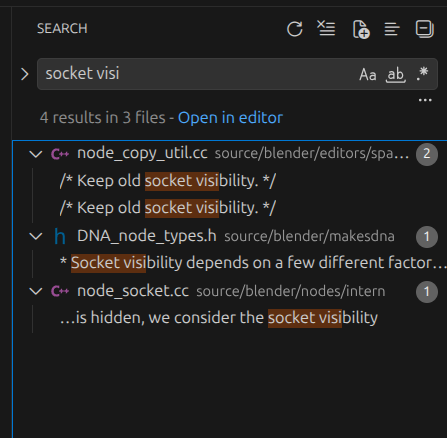
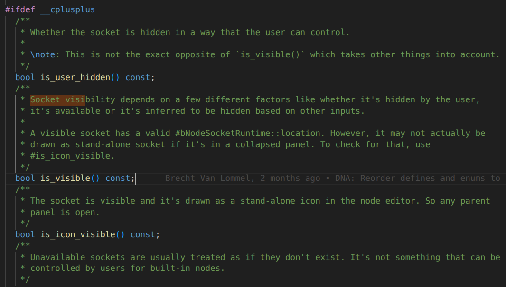
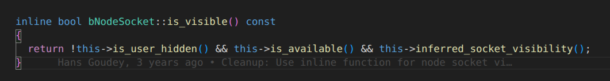
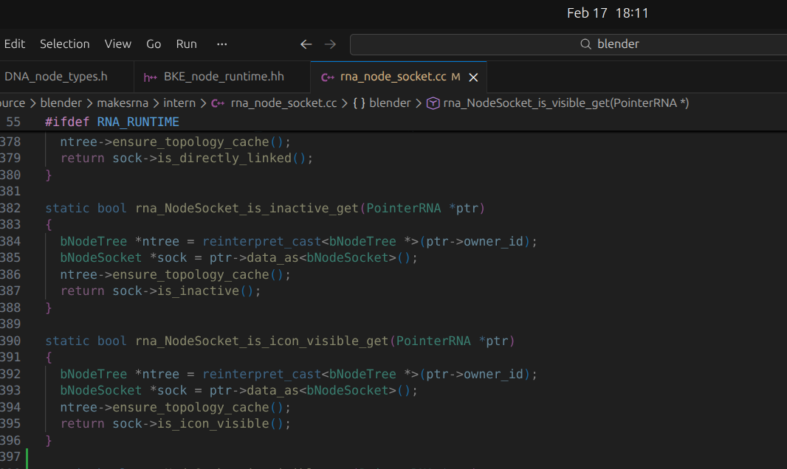
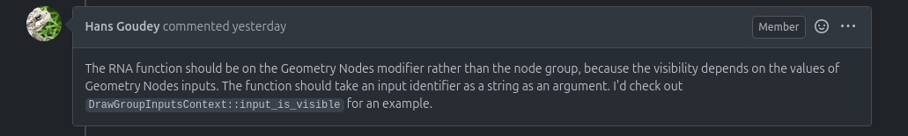
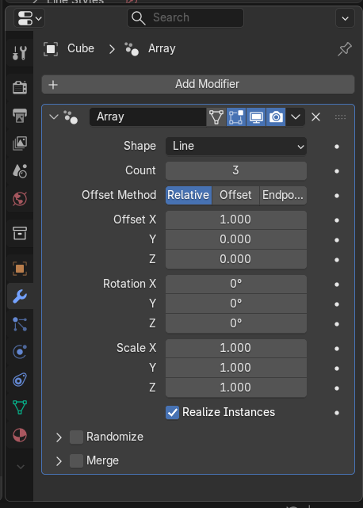
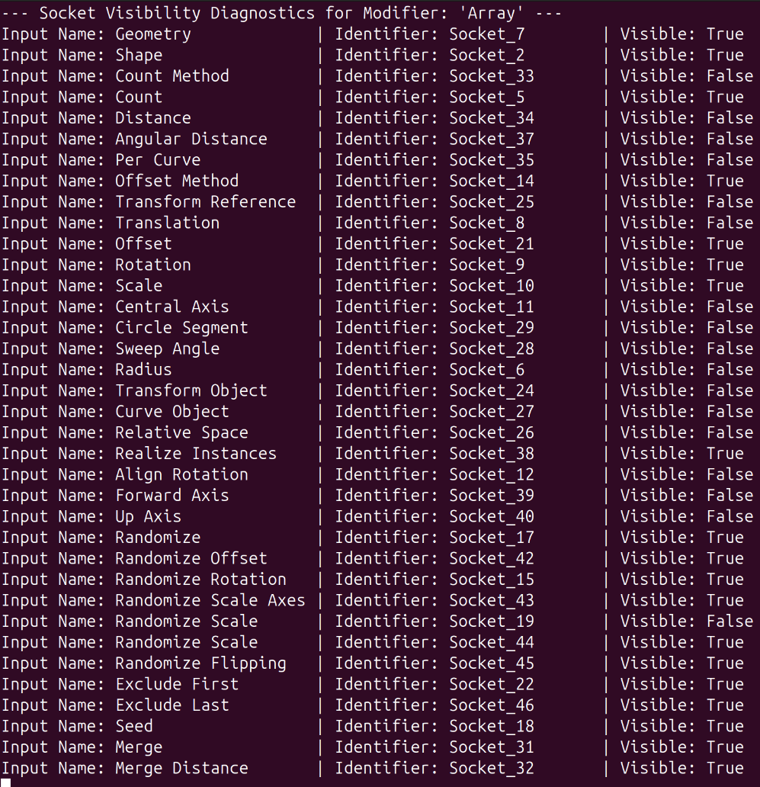
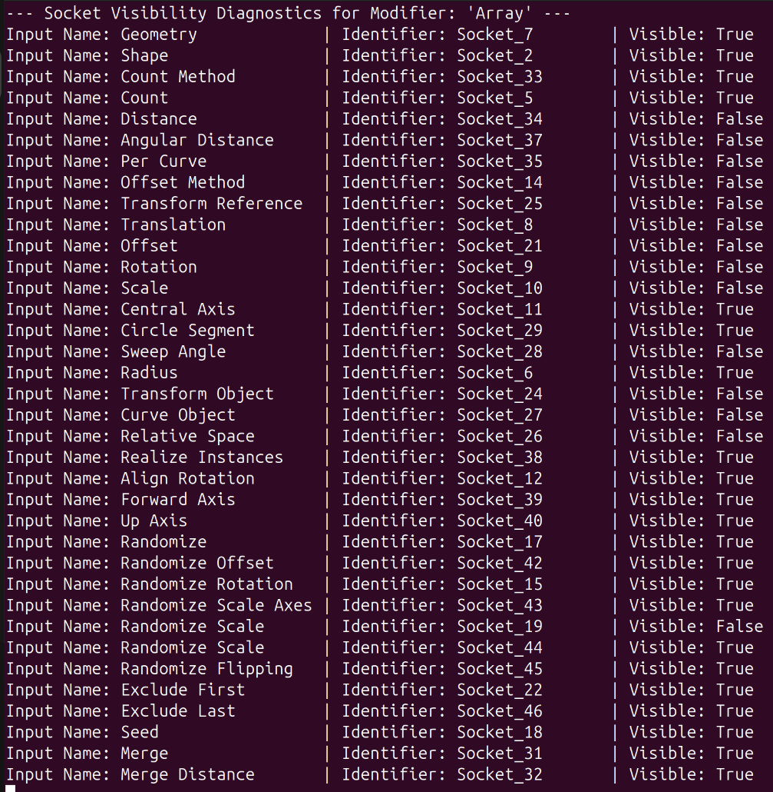

# Exposing Socket Visibility to the Python API (PR #154686)

**The Result:** [PR #154686 - Fix Python API impossible to get if a Socket Input is Visible](https://projects.blender.org/blender/blender/pulls/154686)

## 1. Workflow

- **Task:** Fix issue "Python API - Impossible to get if a Socket Input is Visible in Modifier Panel #154070" in the official Blender repository.
- **Issue Link:** [https://projects.blender.org/blender/blender/issues/154070](https://projects.blender.org/blender/blender/issues/154070)

- **Reasoning:**
    - Get more familiarity with the Blender codebase.
    - Fix my first **not** "Good first issue".
    - Get credibility for the potential mentor as this issue is closely related to the project I will be applying for GSoC.

This is the third issue I am solving and I am still quite unfamiliar with the large Blender codebase, so I will start with doing research in order to understand what specifically is the problem and the potential approach to solving it.

## 2. Research & Context

### Background

Modern Blender modifiers (automated tools that can alter the object's geometry for easy modeling) are built using geometry nodes (a system which processes geometry using raw inputs like vectors). Blender's UI is responsive and automatically hides unnecessary inputs depending on the settings of the modifier (e.g. you do not need a **curve level** input when using a **line** setting in the modifier).

### The Issue

There is a popular add-on for Blender called **Modifier List Add-on** which changes how the modifier stack looks. Their developers are trying to recreate this system. However, while it can see the list of all possible inputs, it cannot see the logic that decides which ones should be hidden right now. As a result, the add-on just lists all the possible inputs in the UI which makes it cluttered.

### Vocabulary

- **Socket:** One of the input dots on a geometry node that corresponds to the UI input field.
- **DNA:** How Blender stores data (saving to .blend files). It consists of raw C data structures.
- **RNA:** This is a translation layer. It defines how the UI with Python scripts accesses that raw DNA data.
- **Decoupled State:** This means the information about "what is visible" isn't stored directly inside the node itself. It is calculated somewhere else.

### Core of the Problem

Logic to "Show/Hide" inputs exists, but only deep in the core C++ code. It is not defined to the RNA and cannot be easily accessed with Python code.

### Potential Solution

Hans Goudey (core dev) suggested to introduce an RNA function on the modifier that gives the current visibility of an input (i.e. write a C++ function in the core code and expose it to Python with RNA).

## 3. The Plan for Solving

1. Find the C++ code that is used to decide if a socket is visible or hidden.
2. Define an RNA function (likely in `rna_modifier.cc`).
3. Create a connection between Python and C++.
4. Test (Python script should be able to run something like `is_input_visible("Count")` and get the information).

## 4. Solving the Issue

As I already have Blender compiled locally, I will start with finding the code which decides if a socket is visible or hidden.

### Step A: Finding the Code

I usually search for the files using search in VS Code.



The `DNA_node_types.h` file should be something I am looking for. Inside the file I found a reference to the function which decides if the socket is visible.



The `is_visible()` function combines all the logic for why the socket should be hidden, therefore I should work with it.



The function itself is located in the `BKE_node_runtime.hh` file.

### Step B: Adding the RNA Function (Initial Attempt)

The next step is to change the RNA file responsible for the socket input and add a function which can be called in Python and will point to this specific C++ code.

RNA files are separated based on the areas they are used in Blender. As I am working with sockets I am going to modify `rna_node_socket.cc`.



My function is going to return true/false depending on if the socket needs to be displayed or not. In Blender the functions in files are grouped logically, so I am going to define my function near the `is_icon_visible` getter. The code of my new function will mostly reproduce the same code for the `is_icon_visible`.

```cpp
static bool rna_NodeSocket_is_visible_get(PointerRNA *ptr)
{
  bNodeTree *ntree = reinterpret_cast<bNodeTree *>(ptr->owner_id);
  bNodeSocket *sock = ptr->data_as<bNodeSocket>();
  ntree->ensure_topology_cache();
  return sock->is_visible();
}

```

**Code Breakdown:**

- `PointerRNA *ptr` — This is the generic pointer for Blender. It is used for every type of data passed to an RNA function.
- `bNodeTree *ntree = reinterpret_cast<bNodeTree *>(ptr->owner_id);` — The socket that will be passed to the function to check is located inside the node tree, we will need access to the id element to update the socket states before returning true or false. `reinterpret_cast` makes brute-force casting. In this case it is necessary because we for sure know that we are working with the tree if we are calling that function, and other casting cannot be used as Blender's code is defined using structs in C which do not have formal C++ inheritance.
- `ptr->owner_id` — With just a pointer we get access to the data. With this part we are accessing the ID (the major element, in this case the nodetree, which owns the data).
- `bNodeSocket *sock = ptr->data_as<bNodeSocket>();` — This line uses a helper function to safely typecast the pointer to the socket type.
- `ntree->ensure_topology_cache();` — For performance reasons Blender does not constantly calculate the current state of nodes and does it periodically when needed. So to make sure we are not working with old node data we force it to update the node information with this line.
- `return sock->is_visible();` — With this last line I am just calling the visibility function that I found earlier.

### Step C: Creating a Reference for Python

Now the function exists inside the RNA C++ code, but it still cannot be accessed via Python as there should be instructions defined on how to do that.

These instructions are defined in the same RNA file and in this specific case they will have 4 lines and will also be logically placed right after `is_icon_visible`.

- `prop = RNA_def_property(srna, "is_visible", PROP_BOOLEAN, PROP_NONE);`
  This line creates a "box" for the property in the API. `srna` is a Struct RNA (the "folder" where I am adding the prop). `"is_visible"` tells Python how the function will be called. `PROP_BOOLEAN` specifies the return type. The last input is used for the subtype (e.g. meter, degree). As we return boolean it does not need a subtype so we leave it as `PROP_NONE`.
- `RNA_def_property_clear_flag(prop, PROP_EDITABLE);`
  This line tells the API that there is no setter function and the user cannot change the `is_visible`. Without this the code will do nothing when a user tries to do that which will create confusion.
- `RNA_def_property_boolean_funcs(prop, "rna_NodeSocket_is_visible_get", nullptr);`
  This part wires the property in Python to the specific C++ function I created. The last input is `nullptr` because we have no setter function.
- `RNA_def_property_ui_text(prop, "Visible", "Socket is enabled and not hidden by the user or by dynamic logic.");`
  This part is documentation. It is just telling the API how this specific function would need to be displayed if it was a button.

### Step D: Pivoting the Approach

Great, I have this function introduced for the Node, but that is not enough. The node file itself is basically a brain of the node, a "black box". Theoretically the API can talk with it directly, but this is not a professional implementation as with an API we want to know what is inside the box without looking directly into it and checking. That is what the Python Interface Tree does. Therefore, now I need to introduce a function in the Interface which would communicate with the node function I have just created and provide the information to the user directly.

The interface file RNA structure is a bit different and we cannot use the same functions, as interface sockets are purely visual and do not contain the information if they need to be turned off or not. So my initial idea was to use the socket ID to find the same socket inside the node and call its function to figure out if we should return true/false.

```cpp
static bool rna_NodeTreeInterfaceSocket_is_visible_get(PointerRNA *ptr)
{
  bNodeTree *ntree = reinterpret_cast<bNodeTree *>(ptr->owner_id);
  bNodeTreeInterfaceSocket *socket = static_cast<bNodeTreeInterfaceSocket *>(ptr->data);

  bNode *input_node = nullptr;

  for (bNode *node = (bNode *)ntree->nodes.first; node; node = node->next) {
    if (node->type == NODE_GROUP_INPUT) {
      input_node = node;
      break;
    }
  }

  if (!input_node) {
    return true;
  }

  for (bNodeSocket *sock = (bNodeSocket *)input_node->outputs.first; sock; sock = sock->next) {
    if (STREQ(sock->identifier, socket->identifier)) {
      return sock->is_visible();
    }
  }

  return true;
}

```

This implementation did not work as I could not get access to the input node itself (the node that holds input sockets that have logic) through the RNA file of the interface. So I asked for advice from the core developer in the issue comments. Below is his answer:



Turns out I was looking at the wrong place. The problem with my logic is that there can be multiple objects which can have the same modifier with different settings applied, and when the user will try to make a call to the interface it will be confused which answer to return as there will be multiple same input sockets. So what he suggested, instead of adding the function to the node and interface RNAs, was to add the function to the modifier RNA.

### Step E: Implementing the Modifier RNA Logic

The function that he was mentioning in the issue before is defined in the `.cc` file which draws the UI, you can see it below:

```cpp
struct DrawGroupInputsContext {
  const bContext &C;
  // ... (other variables) ...

  bool input_is_visible(const bNodeTreeInterfaceSocket &socket) const
  {
    return this->input_usages[this->tree->interface_input_index(socket)].is_visible;
  }
};
}

```

Now I am going to use the logic from this function (`is_input_visible`) and replicate this logic in the modifier RNA. As each modifier has multiple input sockets, the function will take the string ID of the modifier as an input to check if it should be visible or not (the same ID I tried to use in the Interface socket function). The function will be this:

```cpp
static bool rna_NodesModifier_is_socket_visible(NodesModifierData *nmd, const char *identifier)
{
  if (nmd->node_group == nullptr)
    return false;

  if (nmd->runtime == nullptr) {
    return true;
  }
  bNodeTree *ntree = nmd->node_group;

  nmd->runtime->usage_cache.ensure(*nmd);
  const auto &input_usages = nmd->runtime->usage_cache.inputs;
  for (bNodeTreeInterfaceSocket *socket : ntree->interface_inputs()) {

    if (STREQ(socket->identifier, identifier)) {
      int bounds = ntree->interface_input_index(*socket);
      if (bounds < input_usages.size()) {
        return input_usages[ntree->interface_input_index(*socket)].is_visible;
      }
      else {
        return true;
      }
    }
  }
  return false;
}

```

Because this is a function and not a property, instead of passing the pointer to some unknown data, Blender will automatically figure out the object which called the function, so there is no need for typecasting.

**Code Execution Flow:**

- `bNodeTree *ntree = nmd->node_group;` — After I just check that all the data we try to access exists and Blender updated the information, here I get access to the modifier's `bNode` tree, where all the nodes are stored.
- `nmd->runtime->usage_cache.ensure(*nmd);` — Before trying to access the input socket information I make Blender ensure it has the cache as it will help the code look each socket info up with O(1).
- Then I get the information about all input usages from the runtime. And then iterate through all the input sockets inside my modifier using a prebuilt function to access them.
- Inside the loop I am finding the exact socket that the user passed into the function, and just checking the state of this socket using the runtime information I got earlier.
- To have a safety fallback in case the new input was just created and the runtime did not update the information, I make a bounds check to not crash the code.
- If the user entered the wrong socket name the function will just return false with the last line, as such a socket does not exist and therefore is not visible.

### Step F: Registering the Final RNA Function

Now, when the function is defined I need to add it to the RNA so the Python API is able to call it.

```cpp
  func = RNA_def_function(srna, "is_socket_visible", "rna_NodesModifier_is_socket_visible");
  RNA_def_function_ui_description(
      func,
      "Check if a socket is currently visible based on modifier settings, "
      "returns True if the socket is logically visible");
  parm = RNA_def_string(
      func, "identifier", "Identifier", 0, "", "The internal identifier of the socket");
  RNA_def_parameter_flags(parm, PropertyFlag(0), PARM_REQUIRED);
  parm = RNA_def_boolean(func, "result", false, "Result", "");
  RNA_def_function_return(func, parm);

```

**Definition Breakdown:**

- `RNA_def_function` — Here I define the function as before by providing where it will be saved, and the reference in both Python and C++.
- `RNA_def_function_ui_description` — As the name suggests here I provide the UI description for my function which will also serve as Python documentation.
- `RNA_def_string` — Here I define the parameter the user will need to pass to call the function. The first string here is the Python parameter name, the second string is a UI name. The next parameter specifies the maximum length (0 means infinity). Then is the default value. And the last parameter is the UI description for documentation as well.
- `RNA_def_parameter_flags` — Here I configure the property for Python specifying that it is a standard string with `PropertyFlag(0)`, not a dynamic array or hidden property. And stating that this parameter is required for the function to run.
- `RNA_def_boolean` / `RNA_def_function_return` — RNA does not have a separate function to specify the return type, so here I declare it as a parameter first providing the same information as before, and then tell RNA that this parameter is actually a return type of the function.

Now the function should be fully working, and to test it I need to compile Blender and write some Python code with the API.

## 5. Testing

Blender compiled successfully which is a good sign already, so now I only need to test the function.

### Test Setup

I add an Array Modifier to the basic cube, and now need to write the Python script which would check the state of the input sockets on this modifier.

```py
import bpy

obj = bpy.context.active_object
mod = obj.modifiers.get("Array")
tree = mod.node_group

print(f"\n--- Socket Visibility Diagnostics for Modifier: '{mod.name}' ---")

for item in tree.interface.items_tree:
    if item.item_type == 'SOCKET' and item.in_out == 'INPUT':
        identifier = item.identifier
        name = item.name

        is_vis = mod.is_socket_visible(identifier)

        print(f"Input Name: {name:<20} | Identifier: {identifier:<15} | Visible: {is_vis}")

```

Here I access my cube object, get its array modifier, its bNode tree, and iterate through the items of the tree. Make sure the item is an input socket, get its name and string ID, and call my function to check if it is visible. Build a table with all the modifiers.

### Test Results

**Pass 1: "Line" selected in the dropdown**

<table>
  <tr>
    <td></td>
    <td></td>
  </tr>
</table>

**Pass 2: "Circle" selected in the dropdown**

<table>
  <tr>
    <td></td>
    <td></td>
  </tr>
</table>

As it can be seen, all the sockets display the correct information. That means now I can create a new branch, commit the changes in the Blender specific format, and submit a PR fixing the issue.

## 6. Review

I received reviews from Hans Goudey and Jacques Lucke. The changes they requested were:

1. **Remove excess safety checks** for runtime and bounds. If something is wrong with them, there is likely a larger underlying issue that should not be silently ignored.
2. **Change tooltip descriptions.** (e.g., changing "Check if" to "Check whether", and "The internal identifier" to "The identifier").
3. **Rename the function** to `is_input_visible`.
4. **Add a second function** that uses the exact same logic, but checks whether an input `is_used`. The only change is returning `is_used` instead of `is_visible`.

After implementing these changes, the PR was approved.

## 7. Build

During the build, the code faced linkage problems. After adding the missing includes for `BKE_node.hh`, `BKE_node_runtime.hh`, and `BKE_node_tree_interface.hh`, all build tests passed successfully.
